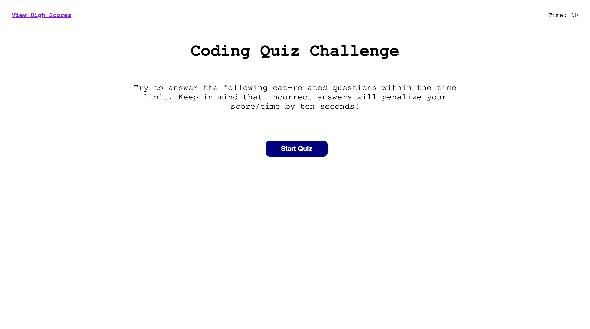

# code-quiz

## Description

The goal for this project was creating the web application that functions as a quiz.
When the user clicks the start button, a timer starts and user presented with the first question.
When the user answers the first question, then the next question is presented.
When the user chooses the wrong answer, the timer subtracts 10 seconds.
When the user finishes up all questions, the score is presented with the form to enter initials.
The score equals to the time left.
When the user enters initials and clicks the submit button, it transfers to the page with the high score.

## Technology Used

[JavaScript](!--https://developer.mozilla.org/en-US/docs/Web/JavaScript--)
[HTML](!--https://developer.mozilla.org/en-US/docs/Web/HTML--)
[CSS](!--https://developer.mozilla.org/en-US/docs/Web/CSS--)
[Git](!--https://git-scm.com--)

## Deployment

[code-quiz](https://elenagurchinskaia.github.io/code-quiz/)

## Author

### Elena Gurchinskaia

- [LinkedIn](https://www.linkedin.com/in/elena-gurchinskaia-4969ab104/)
- [Github](https://github.com/elenagurchinskaia/)

## License

N/A
